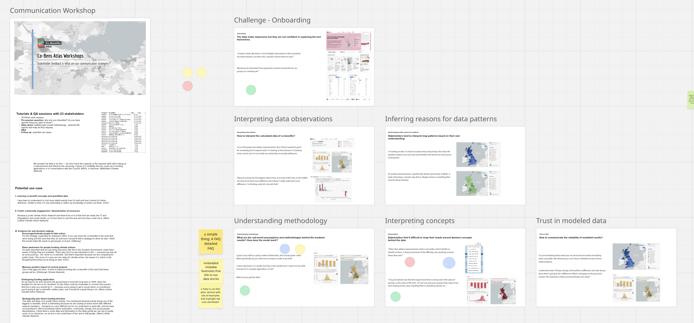

## Reflection from stakeholder onboarding sessions

The lead author did a first round analysis of stakeholder onboarding sessions. The lead author organized the results and shared with the project team using a miro board. The board contains the main codes for envisioned usage scenarios and frictions encountered. Each code is supported by onboarding session participant quotes.

Materials:
