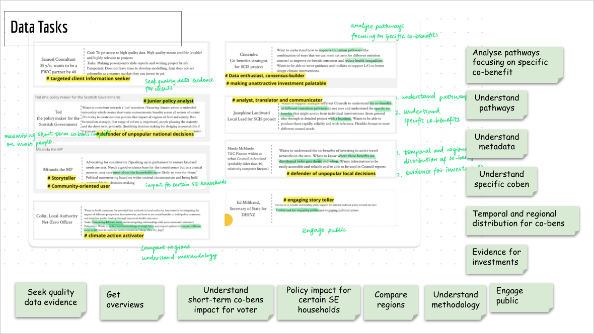
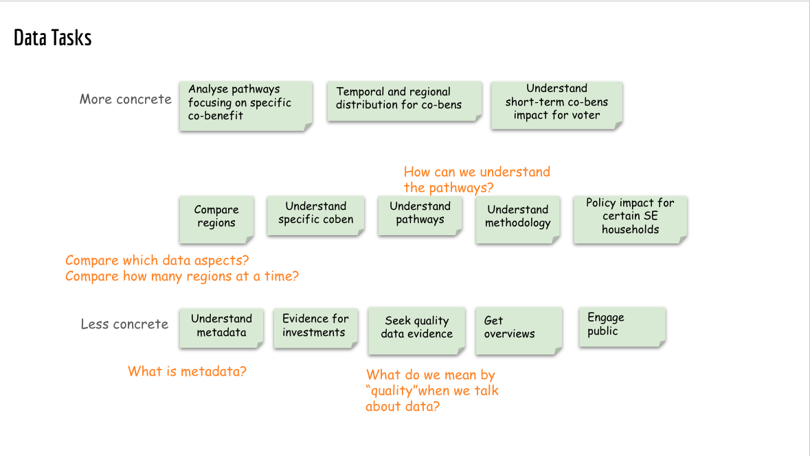
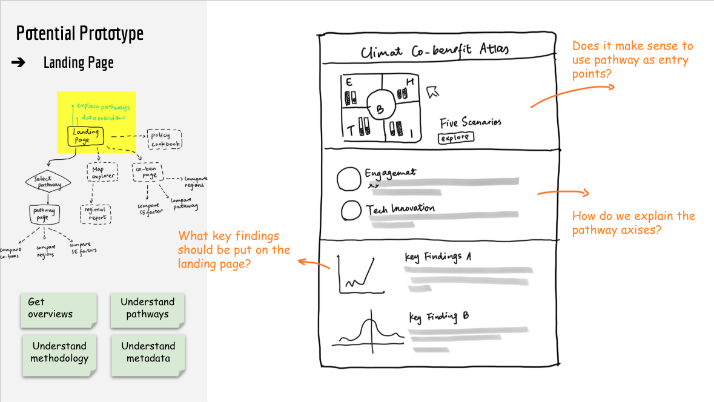
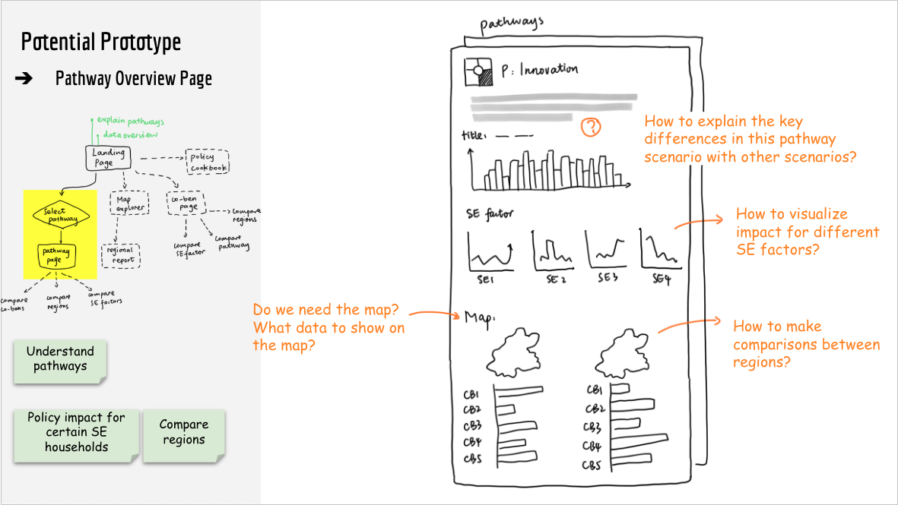
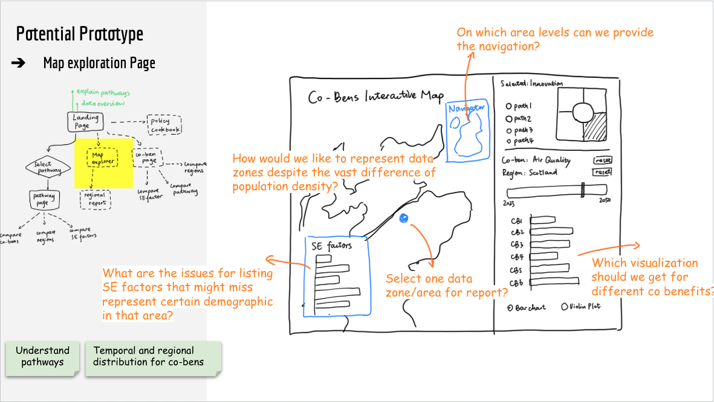
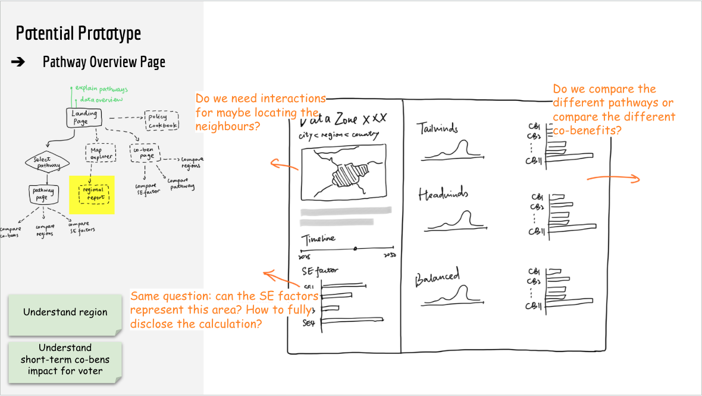

### Identify uncertainties in stakeholder tasks from previous workshops

Tasks brainstormed in previous workshops are vague and remain speculative.

### Initial prototype ideas

The lead author used hand sketches to illustrate the ideas during prototyping sessions (D1, D2). Hand drawn sketches were intended to make the figma prototypes as less certain or polished. 

