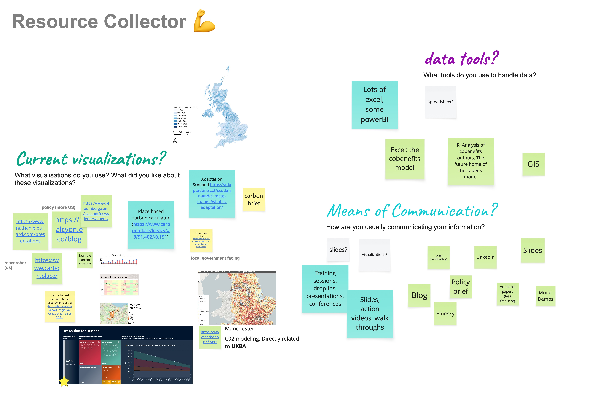
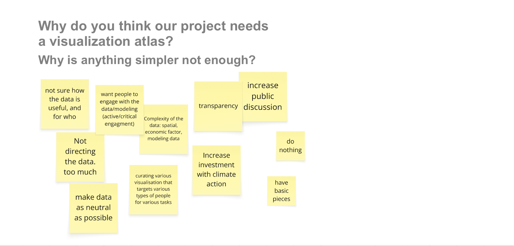
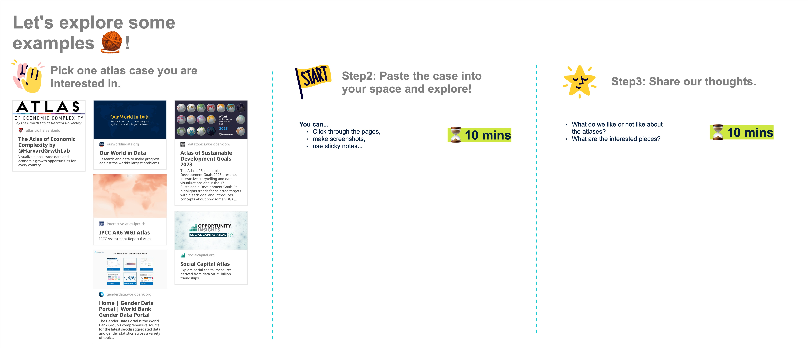
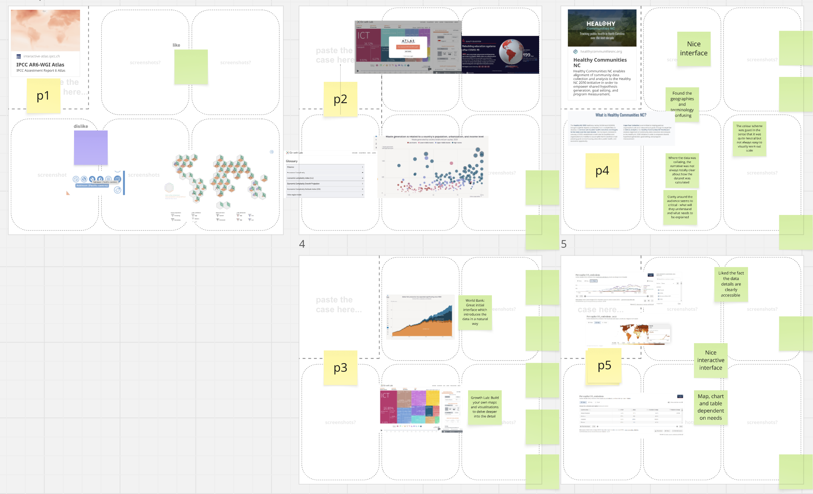
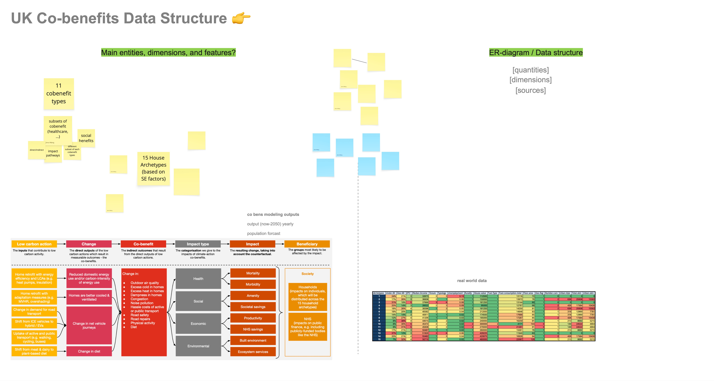

## Goal:
Create a shared understanding among project members around the domain context and the data.

### Q: What are the existing data tools?
**Activity:** Each participant contributed familiar visualization tools and open data platforms from other climate research;

**Materials:** Miro board setup.

### Q: Why do we need an open data platform?
**Activity:** Discussion boards were provided for exploring existing atlases and post-it notes for comments;

**Materials:** Miro board setup.

### Q: How to understand the domain data?
**Activity:** Through a Q&A format discussion, participants answered data-related questions from the other participants.

**Materials:** Miro board setup.

