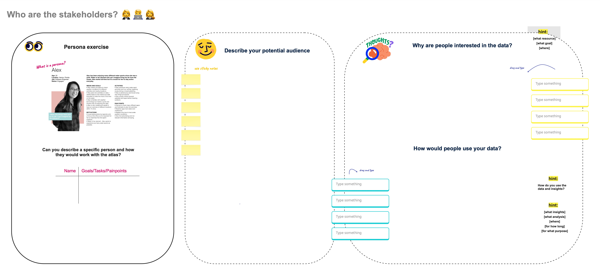
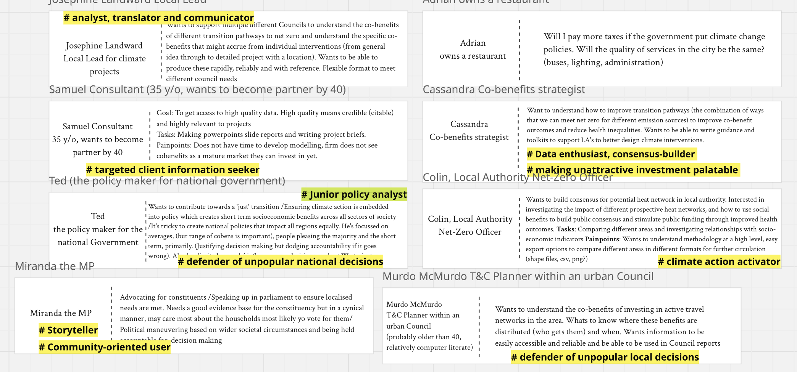

## Goal:
Create speculative stakeholder personas to understand who are the main target audiences.

### Q: Who would be our main stakeholders?
**Activity:** Introduce the concepts of personas.

**Activity:** Brainstorm personas using prompt cards like this and assign concise roles (i.e., their roles relates to the co-benefits atlas):

