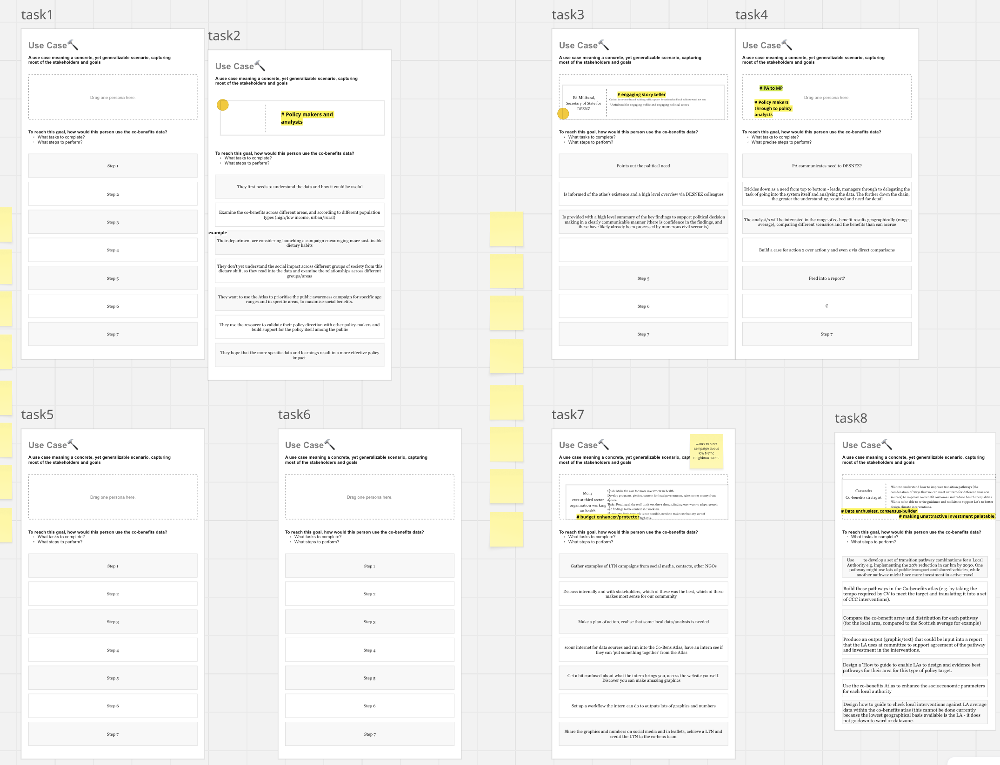
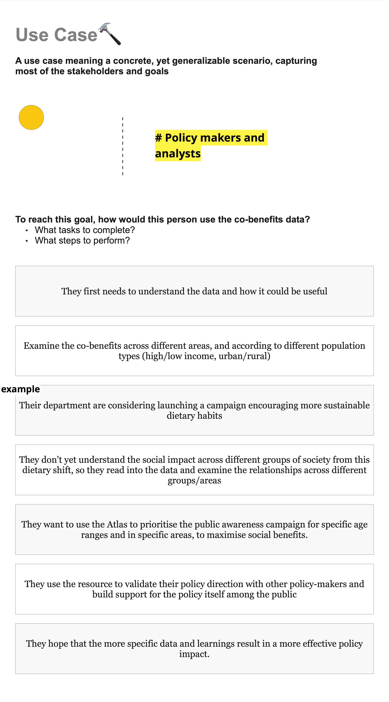
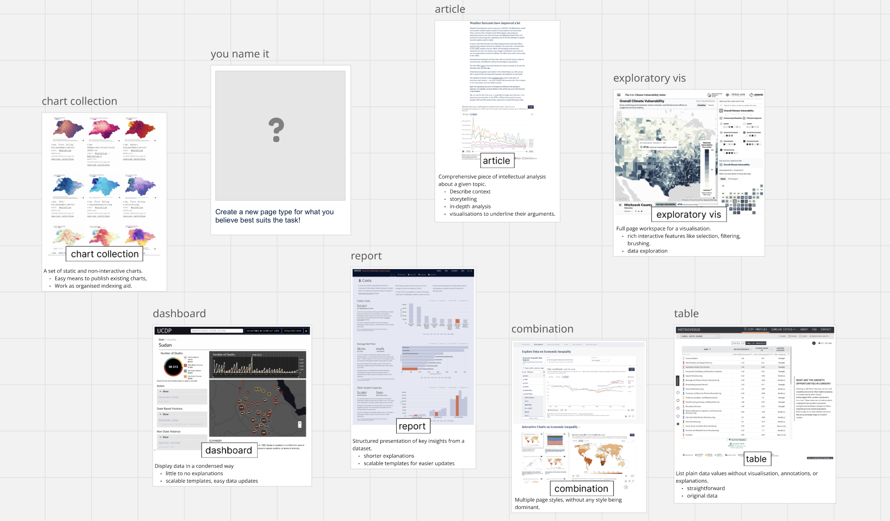
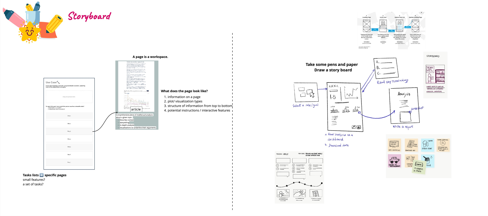
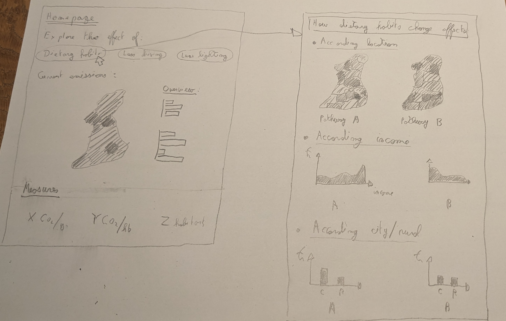
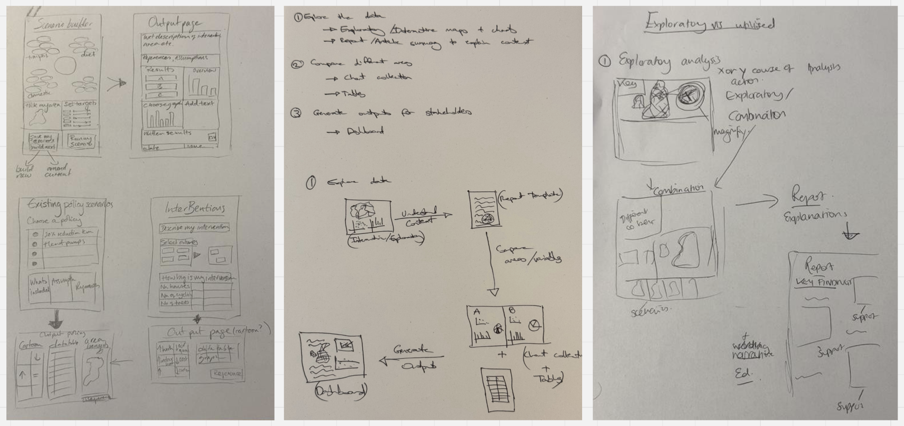

## Goal:
Gather brainstormed design opportunities for different types of atlas content pages based on the variety of stakeholder profiles.

### Q: What usage scenarios would different stakeholders have?
**Activity:** Each participant was asked to pick a persona cards from the previous workshop and brainstorm a specific (speculative) usage scenario and their tasks in using the Atlas using a prompt card.

example scenario in detail:

### Q: What kind of pages the Atlas would need for different stakeholders?
**Activity:** Introduce the concepts of atlas pages based on the pior work (Wang et. a., 2024) and the visualization atlases [online collection](https://vis-atlas.github.io/#/collection). 

**Activity:** Introduce the sketching for pages activity: each parcipant brainstorm the layout and visuaization required to support the task described in their respective persona cards.

Example results:

