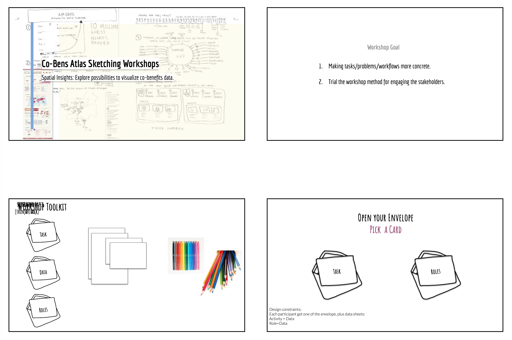
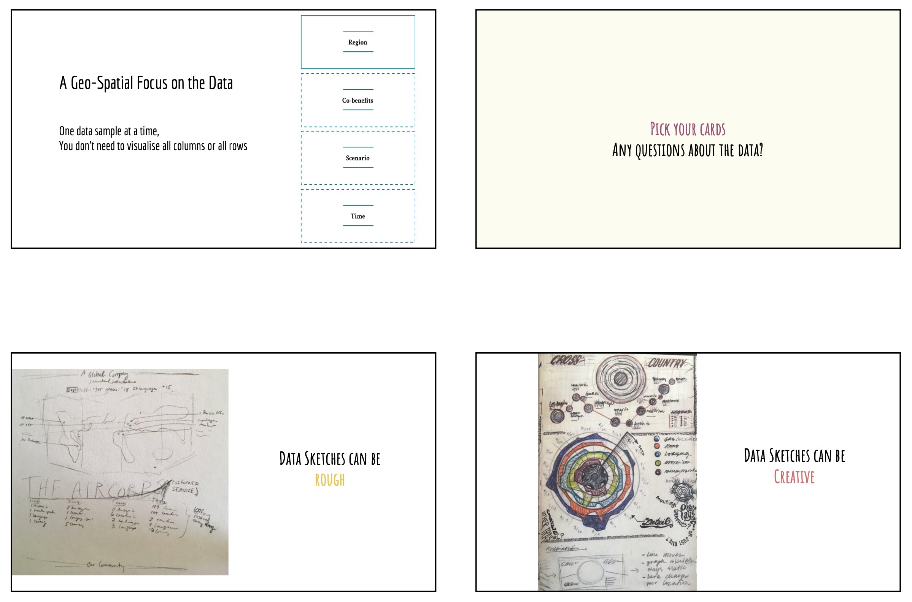
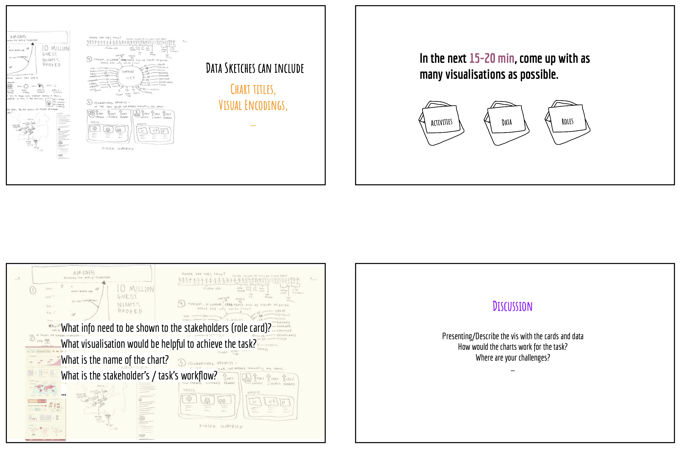
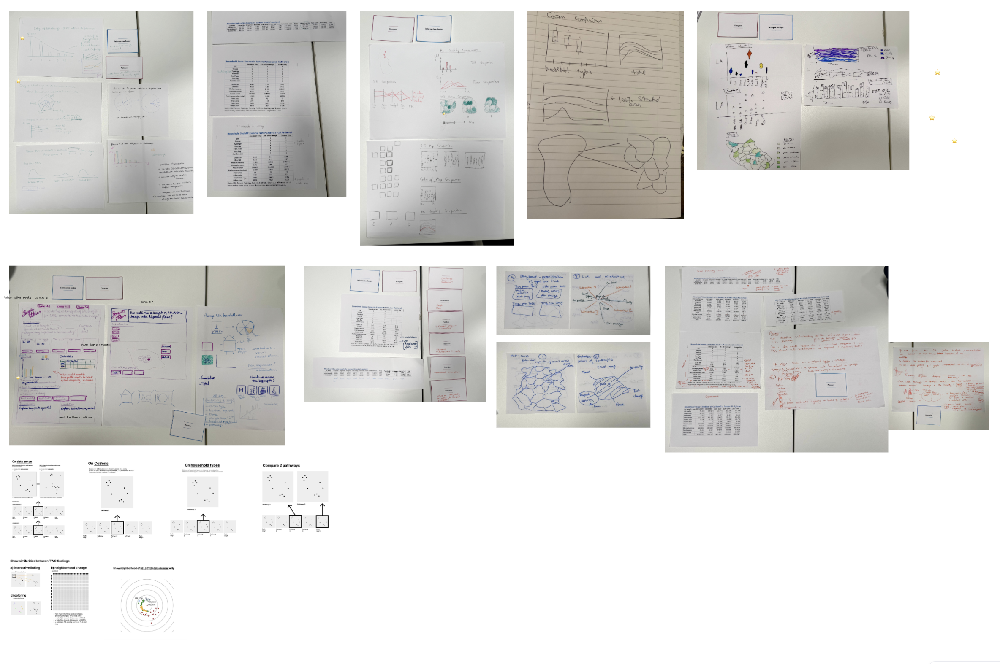
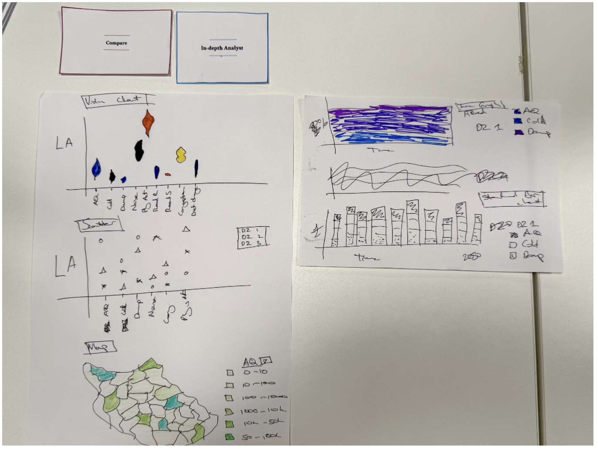

## Goal:
Explore specific visualization design opportunities. 

### Q: What individual visualizations to include in atlas pages?
**Activity:** In W3, we observed that participants mostly focused on sketching page layouts, rather than data representations. We introduced a dedicated visualization sketching session with the support of “data” and “goal” cards, derived from previous workshop sessions to facilitate ideation.

**Warm up:** Introduction about sketching visualizations to support participants who are non-experts in sketching and design.

**Results:**

Detailed examples:

