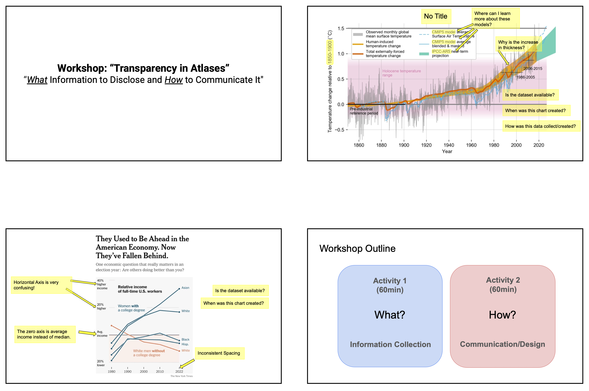
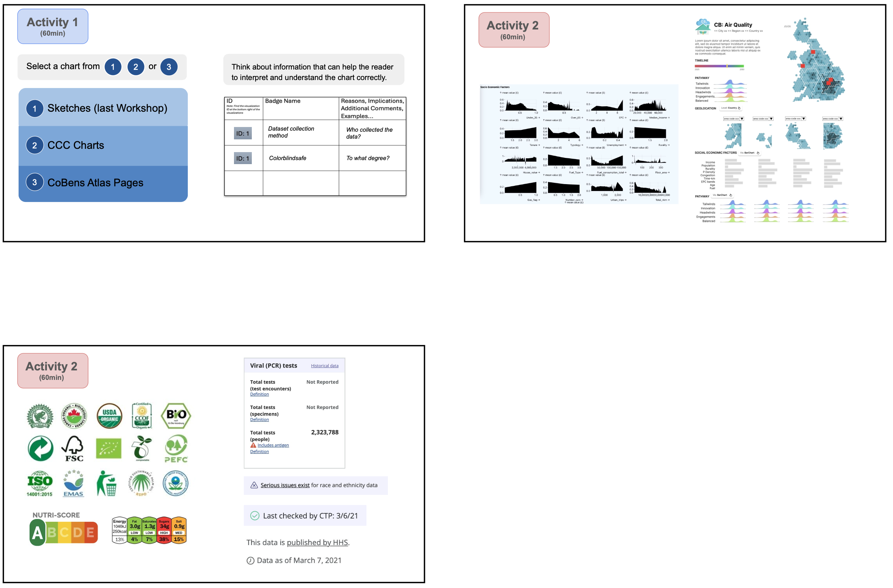
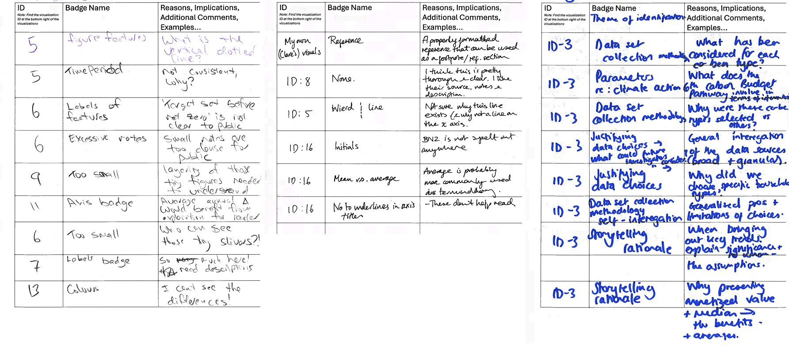
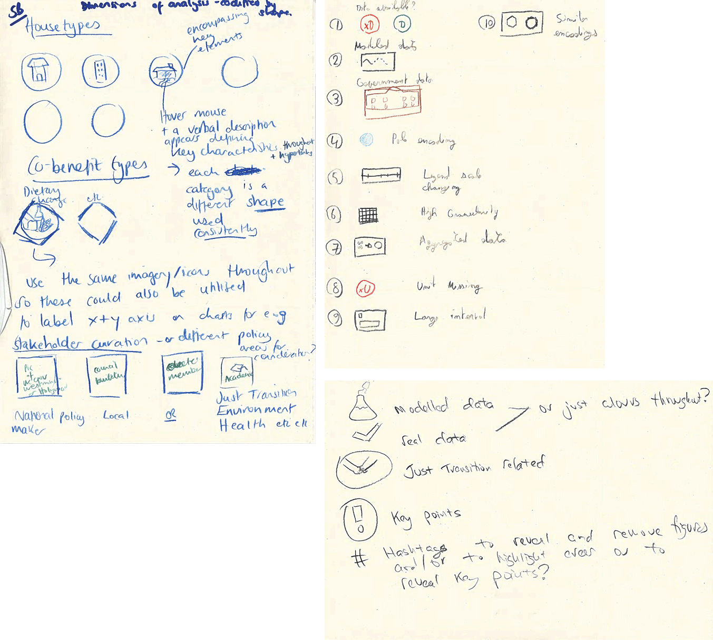

## Goal:
Explore the prioritization of contextual information to enhance transparency.

### Q: What information needs disclosure to enhance transparency??
**Activity:** Participants were encouraged to use the labels to signpost important contextual information such as data source types, methodological assumptions, and key insights.

**Materials**

**Results examples**:

