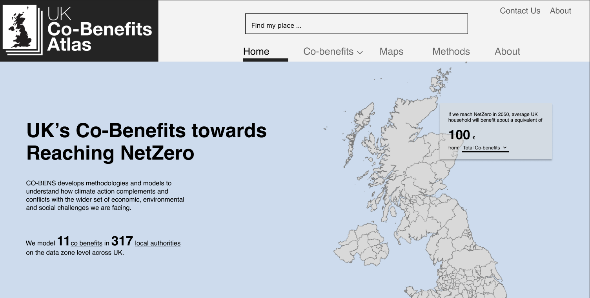
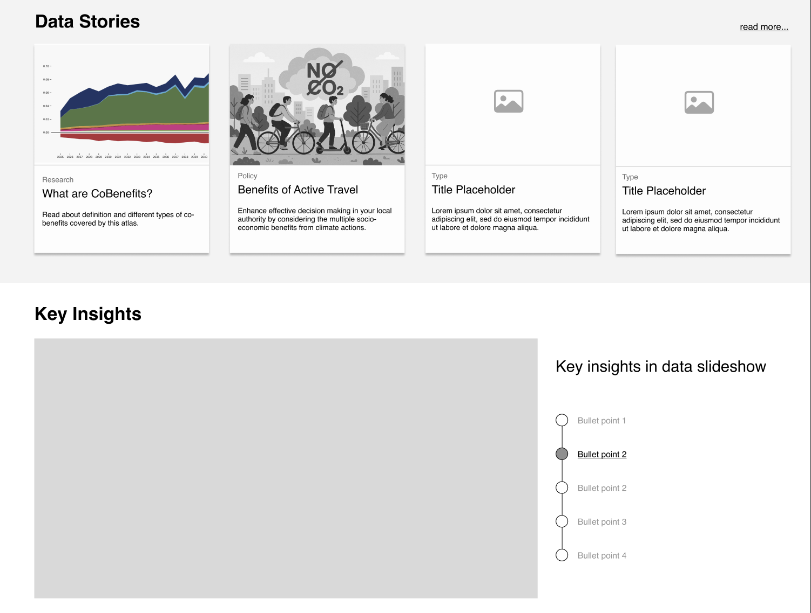
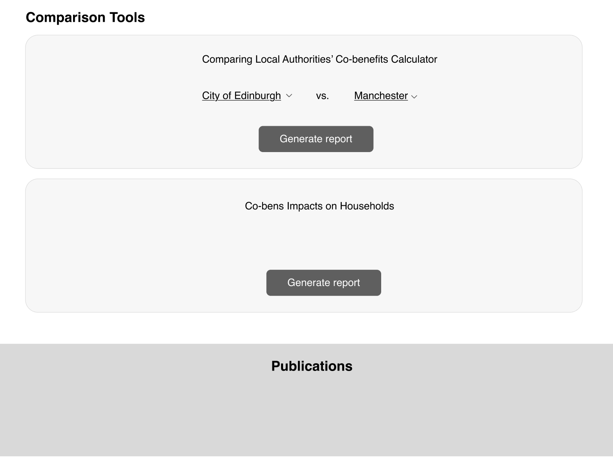

## Goal:
Explore design options for atlas entry points and visual consistencies.

### Q: What entry points do we provide for audiences?
**Activity:** We provided a range of low-fi wireframes of potential landing
page components including navigation bars, search bar, data overviews, and slide-decks as prompts to brainstorm
what types of entry points should be prioritized for the Atlas’ landing page.

Workshop participants discussed their opinions verbally.

**Materials**

### Q: How to create a consistent color scheme?
**Activity:** A set of icons and a large color palette were provided to facilitate a pick-and-choose session for participants to assign colors to data dimensions based on intuitive fit within their domain.

Workshop participants discussed their opinions verbally.

