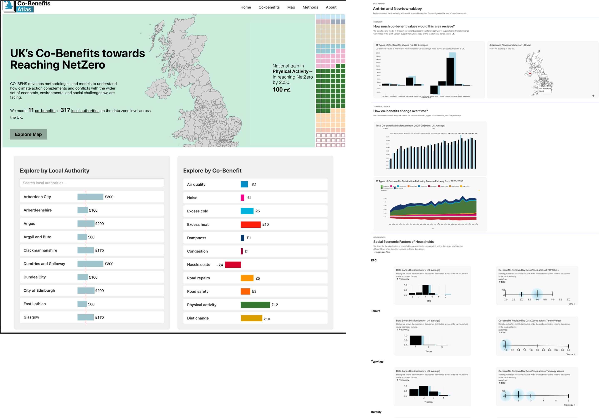
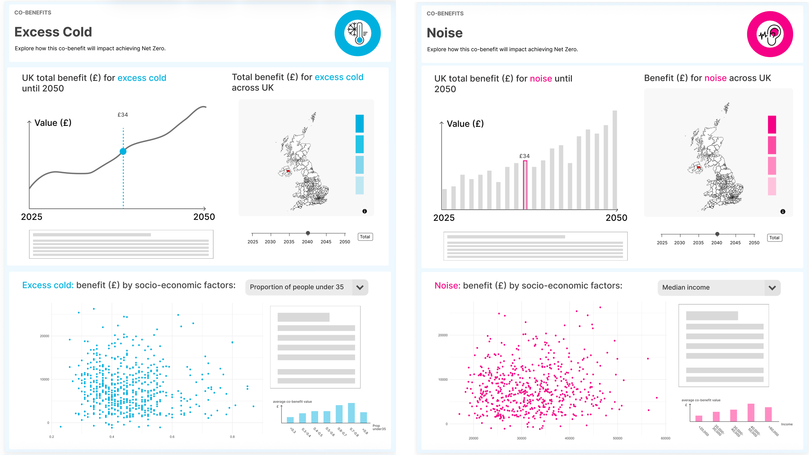
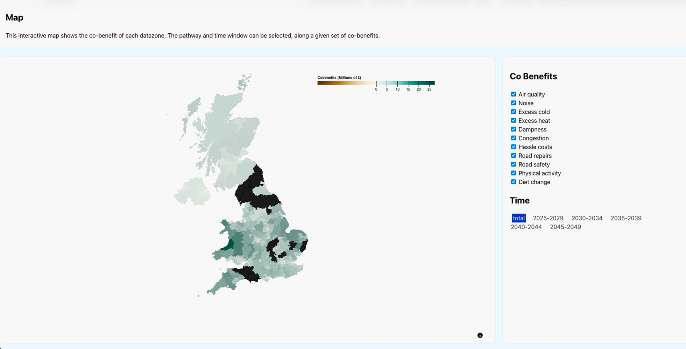

## Goal:
Visualization experts sync with other workshop participants on page iterations.

### Q: How to improve the pages? 
**Activity:** In progress Atlas pages implemented with real data are provided to be openly discussed among workshop participants. These pages are printed for easy annotation.

Workshop participants discussed their opinions verbally.

**Materials**

Landing page and local authority report page template:

Co-benefits report template:

Map page:

