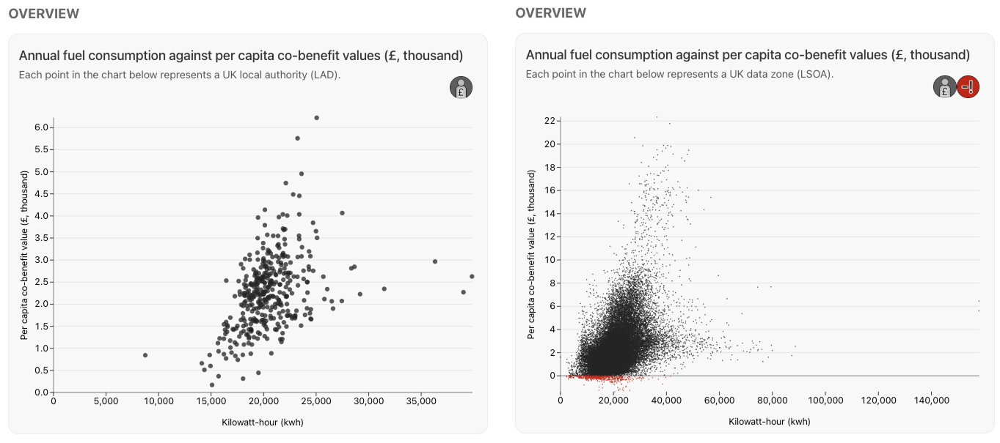
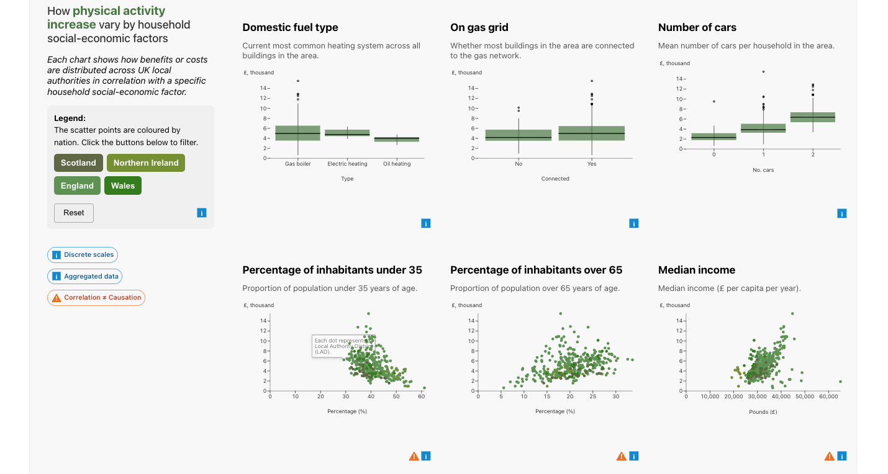

## Goal:
Visualization experts sync with other workshop participants to explore specific data mappings on interactive pages. 

### Q: How to specify data mappings?
**Activity:** The visualization team prepared lists of data design decisions for consideration, for example how the graphical axes should consistently be represented and through which data units.

Workshop participants discussed their opinions verbally.

For example:

- Whether to use low level geographical units (Data Zone/LSOA) or aggregated unit (local authority/city) as default for socio-economic factors report page.

- Should we prioritize certain socio-economic factors that are more prominent in their correlation to co-benefit value in the co-benefit report page?
